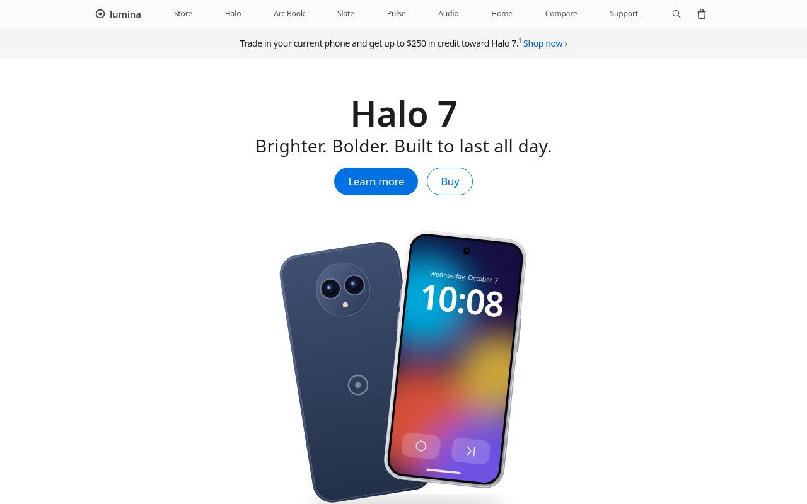

# Lumina — Apple-style Product Landing Page

A polished, fully responsive product landing page for **Lumina**, a fictional consumer-tech brand. It recreates the look and feel of a premium tech homepage: translucent sticky navigation, big alternating hero sections, product tiles, a photo carousel, and a model comparison. It is built with plain HTML, CSS and vanilla JavaScript, with no frameworks and no build step.

**Live demo:** https://som-info.github.io/apple-style-landing/



## Features

- **Translucent sticky global nav** with backdrop blur. It turns solid on scroll and switches to a dark theme over dark sections.
- **Full-width hero sections** that alternate light, dark and grey, each with a large headline, subhead and pill-shaped "Learn more" / "Buy" links.
- **2-up product tiles grid** with original SVG product renders and a photo tile.
- **Scroll-triggered reveal animations** (fade, slide-up, zoom) powered by `IntersectionObserver`.
- **Horizontal photo carousel** with scroll-snap, prev/next arrows, dot pagination, keyboard arrows, and autoplay that only runs while the carousel is visible. It also has a play/pause toggle.
- **Compare models section** with color swatches that recolor each phone and specs side by side. On mobile it becomes a horizontal scroller.
- **"Why buy" feature cards**, a search panel with quick links, and a demo shopping bag (badge count is saved in `localStorage`).
- **Mobile navigation**: a full-screen hamburger menu that closes on Esc, on link click or on resize.
- **Detailed multi-column footer** that collapses into an accordion on small screens.
- **Accessibility**:
  - semantic landmarks and a skip link
  - ARIA states on all toggles
  - visible focus styles and keyboard support
  - full `prefers-reduced-motion` support (no animations, carousel autoplay off)
- **Responsive** at 375 px (mobile), 768 px (tablet) and 1280 px+ (desktop).

## Tech

- HTML5 (semantic markup)
- CSS3:
  - custom properties
  - Grid and Flexbox
  - `scroll-snap`
  - `backdrop-filter`
  - `mask-image`
  - media queries
- Vanilla JavaScript (ES5+, no dependencies):
  - `IntersectionObserver`
  - `requestAnimationFrame`
  - `localStorage`
- No build step. It runs on GitHub Pages or any static host.

## Project structure

```
.
├── index.html
├── css/
│   └── style.css
├── js/
│   └── main.js
├── assets/
│   ├── logo.svg, favicon.svg
│   ├── screenshot.jpg
│   └── img/          # SVG product renders + optimized photos
├── README.md
└── .gitignore
```

## Run locally

Open `index.html` in a browser, or serve the folder:

```bash
python3 -m http.server 8000
# then visit http://localhost:8000
```

## Deploy to GitHub Pages

Push the files to the repository root. Then go to **Settings → Pages → Deploy from a branch** and choose `main` / root.

## Credits

- Landscape and headphone photos come from [Unsplash](https://unsplash.com) and are used under the Unsplash License.
- The device illustrations, logo and icons are original SVG artwork made for this project.

## Disclaimer

This is a design study for a portfolio. It is **not affiliated with, endorsed by, or connected to Apple Inc.** "Lumina" and all product names (Halo, Arc Book, Slate, Pulse, Aura Studio, Orbit) are fictional. Prices and specs are made up, and nothing is sold.

## Author

**Amir Namvar** — [GitHub @som-info](https://github.com/som-info)
